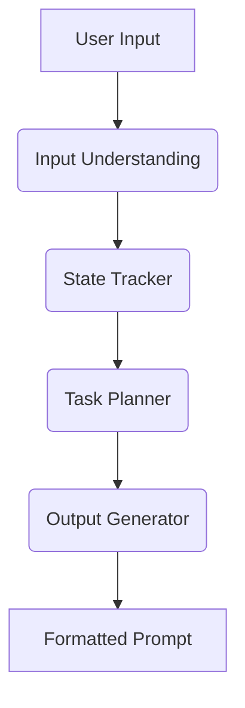

```markdown
# PromptCraft - AI Writing Prompt Generator


An intelligent agent that generates personalized writing prompts for content creators using a 4-layer AI architecture.

## Features

- **Context-Aware Prompts**: Remembers user preferences and past topics
- **Multi-Format Outputs**: Generates primary prompt + variations
- **Niche Specialization**: Adapts to different writing domains (tech, food, travel etc.)
- **Tone Control**: Supports various writing styles (humorous, serious, etc.)

## Architecture



## Installation

1. Clone the repository:
```bash
git clone https://github.com/yourusername/promptcraft.git
cd promptcraft
```

2. Set up virtual environment:
```bash
python -m venv venv
source venv/bin/activate  # Linux/Mac
venv\Scripts\activate  # Windows
```

3. Install dependencies:
```bash
pip install -r requirements.txt
```

4. Create `.env` file:
```ini
OPENAI_API_KEY=your_api_key_here
```

## Usage

### Basic Usage
```python
from prompt_agent import PromptCraftAgent

agent = PromptCraftAgent()
response = agent.run_agent("Give me a creative writing prompt about space exploration")
print(response)
```

### Command Line
```bash
python prompt_agent.py
```

### Sample Output
```
**Describe a day in the life of a Martian colonist**
- Write about Earth as seen from a Mars colony
- Create a story about discovering alien microbes
*What would be the biggest cultural difference?*
```

## Configuration

Customize in `prompt_agent.py`:
```python
# Memory settings
self.max_memory_items = 5  # How many items to remember

# Generation parameters
self.model = "gpt-3.5-turbo"  # Switch to "gpt-4" for better quality
self.temperature = 0.7  # 0-2, higher = more creative
```

## API Reference

### `PromptCraftAgent` Class

| Method | Description |
|--------|-------------|
| `parse_input()` | Layer 1: Extracts structured data from user input |
| `update_memory()` | Layer 2: Maintains conversation context |
| `plan_prompts()` | Layer 3: Creates generation strategy |
| `generate_output()` | Layer 4: Produces formatted prompts |

## Examples

**Tech Writing:**
```python
agent.run_agent("Give me a technical deep dive prompt about blockchain")
```

**Food Blogging:**
```python
agent.run_agent("Need a fun prompt about vegan desserts for Instagram")
```

## Limitations

- Requires OpenAI API key
- Short-term memory only (no database persistence)
- English language only

## Contributing

1. Fork the project
2. Create your feature branch (`git checkout -b feature/AmazingFeature`)
3. Commit changes (`git commit -m 'Add amazing feature'`)
4. Push to branch (`git push origin feature/AmazingFeature`)
5. Open Pull Request

## License

Distributed under the MIT License. See `LICENSE` for more information.

## Contact

Your Name - your.email@example.com

Project Link: [https://github.com/yourusername/promptcraft](https://github.com/yourusername/promptcraft)
```

---

### Key Sections Included:

1. **Project Metadata**: Badges and description
2. **Visual Architecture**: Mermaid diagram
3. **Setup Instructions**: Environment configuration
4. **Usage Examples**: Multiple formats
5. **Configuration Options**: Customizable parameters
6. **API Documentation**: Class method reference
7. **Example Prompts**: Domain-specific samples
8. **Project Management**: Contribution guidelines

The README provides both technical documentation for developers and easy-to-follow instructions for end users. You can customize the contact information, license, and repository links as needed.
